  
   
  
  

    <a href="mailto:madanbelbase927@gmail.com">Email</a> •
    <a href="https://linkedin.com/in/madan-belbase">LinkedIn</a> •
    <a href="https://github.com/MadanBelbase">GitHub</a> •
    <a href="https://madanbelbase.com.np">Portfolio</a>
  

---

## About Me
- Currently working on real-time collaboration tools & ML pipelines
- Learning advanced TypeScript, AWS, and Machine Learning
- Open to freelance work, collaborations, and open-source contributions
- Based in Kathmandu, Nepal
- Coffee-dependent developer
---

## Tech Stack
**Frontend:** React, TypeScript, HTML/CSS, Tailwind  
**Backend:** Node.js, Python, Express  
**Database:** PostgreSQL, MongoDB  
**Cloud & Tools:** AWS, Git, Docker

---

## Latest Blog Posts

- Blog on [madanbelbase.com.np](https://madanbelbase.com.np/)
---
- Portfolio  on [profile.madanbelbase.com.np](https://profile.madanbelbase.com.np/)
---

## Get in Touch
- **Email:** madanbelbase927@gmail.com
- **LinkedIn:** linkedin.com/in/madan-belbase
- **Portfolio:** profile.madanbelbase.com.np

---

  

